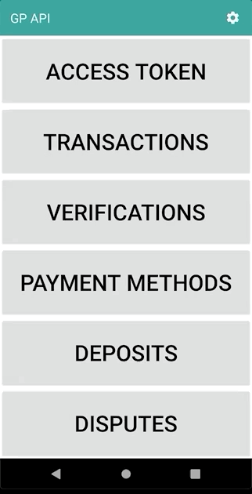
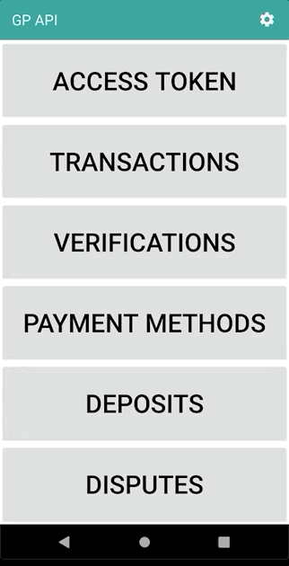

<a href="https://github.com/globalpayments" target="_blank">
    
</a>

# GlobalPayments Android SDK
You can find more information on how to use this SDK and sign up for a free Global Payments sandbox account at https://developer.globalpay.com

## Requirements

- Android 5.0+ (API 21+)

## Installation

Declare mavenCentral repository in the root build.gradle file:

```Gradle
allprojects {
    repositories {
        mavenCentral()
    }
}
```

Declare dependency in the app build.gradle file:

```Gradle
dependencies {
    implementation 'com.heartlandpaymentsystems:globalpayments-android-sdk:1.0'
}
```

## Documentation and Examples

You can find the latest SDK documentation along with code examples and test cards on the [Global Payments Developer Portal](https://developer.globalpay.com).

#### Process a Payment Example

```Java
/// Prepare required configuration
GpApiConfig config = new GpApiConfig();
config.setServiceUrl("Service Url"); //(Sandbox URL: "https://apis.sandbox.globalpay.com/ucp")
config.setAppId("Your application ID");
config.setAppKey("Your application key");

/// Add config to container
ServicesContainer.configureService(config);

/// Prepare card
CreditCardData card = new CreditCardData();
card.setNumber("4111111111111111");
card.setExpMonth(12);
card.setExpYear(2025);
card.setCvn("123");

// Execute operation
Transaction transaction = card.charge(new BigDecimal("19.99"))
    .withCurrency("USD")
    .execute();
```

#### Test Card Data

Name        | Number           | Exp Month | Exp Year | CVN
----------- | ---------------- | --------- | -------- | ----
Visa        | 4263970000005262 | 12        | 2025     | 123
MasterCard  | 2223000010005780 | 12        | 2019     | 900
MasterCard  | 5425230000004415 | 12        | 2025     | 123
Discover    | 6011000000000087 | 12        | 2025     | 123
Amex        | 374101000000608  | 12        | 2025     | 1234
JCB         | 3566000000000000 | 12        | 2025     | 123
Diners Club | 36256000000725   | 12        | 2025     | 123

## Sample App Demo Clips

Transaction Report | Transaction Operation
-------------------| ---------------------
 | 

#### Verification


Payment Method Operation | Payment Method Report
-------------------------| ---------------------
 | 

#### Deposits Report



Disputes Report | Disputes Operation
----------------| ---------------------
 | 