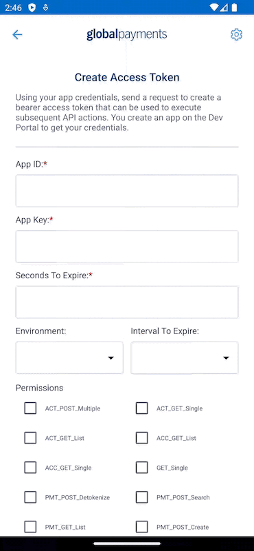
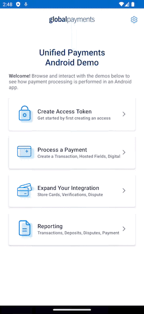
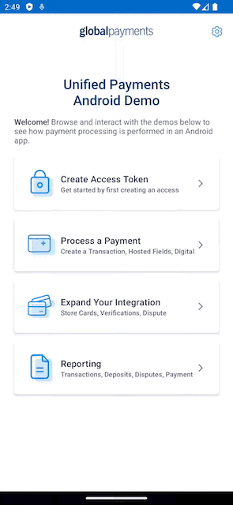
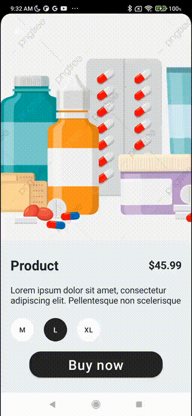
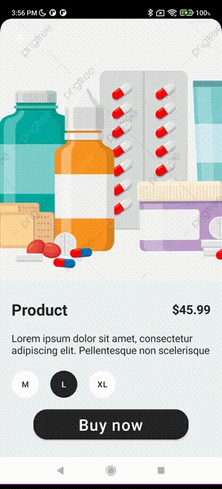

<a href="https://github.com/globalpayments" target="_blank">
    
</a>

# GlobalPayments Android SDK

You can find more information on how to use this SDK and sign up for a free Global Payments sandbox
account at https://developer.globalpay.com

## Requirements

- Android 5.0+ (API 21+)

## Installation

Declare mavenCentral repository in the root build.gradle file:

```Gradle
allprojects {
    repositories {
        mavenCentral()
    }
}
```

Declare dependency in the app build.gradle file:

```Gradle
dependencies {
    implementation 'com.heartlandpaymentsystems:globalpayments-android-sdk:1.0'
}
```

You can find the latest SDK documentation along with code examples and test cards on
the [Global Payments Developer Portal](https://developer.globalpay.com).

# Sample app

A [sample app](sample-app) of how to integrate java-sdk directly into your mobile application.

## Requirements

- Android 5.0+ (API 21+)
- Java 1.8
- Kotlin 1.9.23
- Credentials from the [Global Payments Developer Portal](https://developer.globalpay.com)
- For the latest Netcetera SDK sandbox API key and certificate please reach out to Global Payment
  support team.

## Installation

- Clone the project
- Import the project in Android Studio or Intellij
- Update `configuration.properties` with the `appKey` and `appId` that you've created previously on
  the [Global Payments Developer Portal](https://developer.globalpay.com)
- To run Netcetera 3DS sample place the `acs.pem` files into the `assets` folder and update
  `configuration.properties` with the `apiKey` so that the Netcetera 3DS SDK can initialize
- Select `sample-app` from configuration and run the app

#### Test Card Data

| Name        | Number           | Exp Month | Exp Year | CVN  |
|-------------|------------------|-----------|----------|------|
| Visa        | 4263970000005262 | 12        | 2025     | 123  |
| MasterCard  | 2223000010005780 | 12        | 2019     | 900  |
| MasterCard  | 5425230000004415 | 12        | 2025     | 123  |
| Discover    | 6011000000000087 | 12        | 2025     | 123  |
| Amex        | 374101000000608  | 12        | 2025     | 1234 |
| JCB         | 3566000000000000 | 12        | 2025     | 123  |
| Diners Club | 36256000000725   | 12        | 2025     | 123  |

## Sample App Demo Clips

#### Main screen


#### Create Access Token



| Hosted Fields                     | Google Pay                     |
|-----------------------------------|--------------------------------|
|  |  |

| Transactions Report                  | Stored Payments                     |
|--------------------------------------|-------------------------------------|
|  |  |

---

# Merchant 3DS example

A [sample app](merchant3ds) of how to integrate Netcetera SDK.

## Requirements

- Android 5.0+ (API 21+)
- Java 1.8
- Kotlin 1.9.23
- Backend
  from: https://github.com/globalpayments/java-sdk/tree/master/examples/iOS-Hybrid-App-Java-Server
- For the latest Netcetera SDK sandbox API key and certificate please reach out to Global Payment
  support team.

## Installation

- Clone the project
- Import the project in Android Studio or Intellij
- Update `configuration.properties` file with the url where the java backend is running
- Update `configuration.properties` with the `appKey` and `appId` that you've created previously on
  the [Global Payments Developer Portal](https://developer.globalpay.com)
- To run Netcetera 3DS sample place the `acs.pem` files into the `assets` folder and update
  `configuration.properties` with the `apiKey` so that the Netcetera 3DS SDK can initialize
- Select `merchant3ds` from configuration and run the app
- For configuration of the java backend
  check [Merchant3DSSpringBackend](https://github.com/globalpayments/java-sdk/blob/master/examples/iOS-Hybrid-App-Java-Server/README.md)

## Documentation and Examples

You can find documentation for Netcetera SDK
on [Netcetera website](https://3dss.netcetera.com/3dssdk/doc/2.4.0/)

#### App configuration

Edit the [configuration file](merchant3ds/configuration.properties) with the appropriate values from
the backend example

#### Test Card Data

| Name | Number           | Exp Month | Exp Year | CVN | Type         |
|------|------------------|-----------|----------|-----|--------------|
| Visa | 4012001038488884 | 12        | 2025     | 123 | Challenge    |
| Visa | 4263970000005262 | 12        | 2025     | 123 | Frictionless |

### Sample App Demo Clips

| Netcetera Challenge             | Decoupled flow                        |
|---------------------------------|---------------------------------------|
|  |  |
